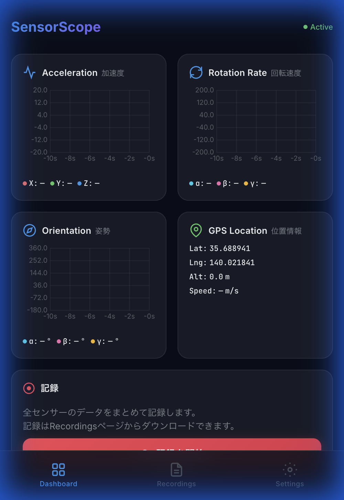
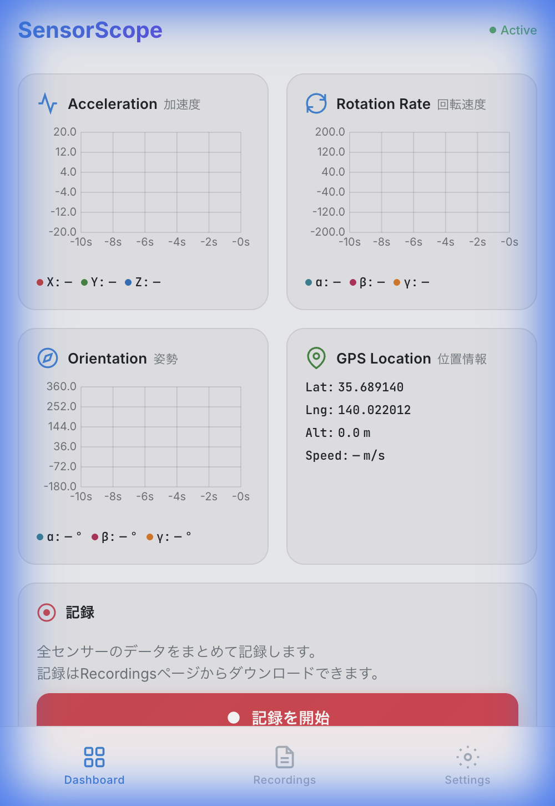
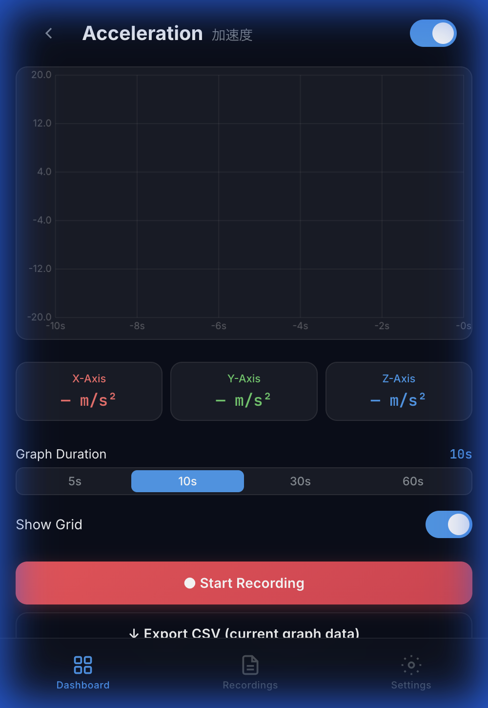
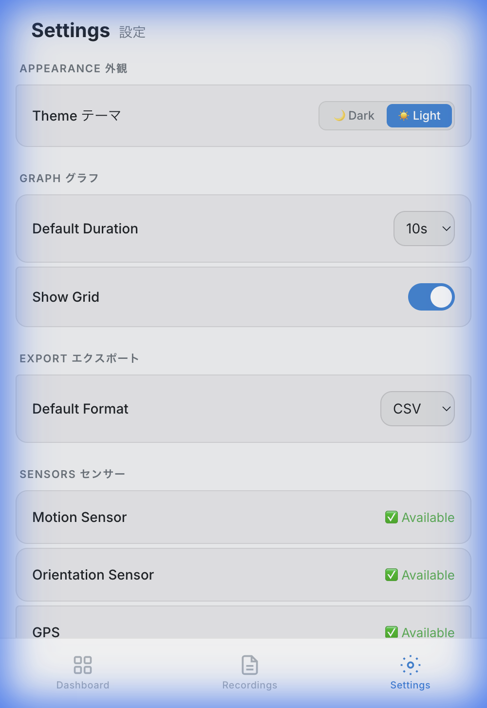

# SensorScope — モバイルセンサー可視化・記録 PWA

<p align="center">
  
  
  
</p>

SensorScope は、スマートフォンの各種センサーデータをリアルタイムで可視化・記録できる **Progressive Web App (PWA)** です。外部ライブラリ不要で、HTML / CSS / JavaScript のみで動作します。

---

## ✨ 主な機能

| 機能 | 説明 |
|------|------|
| **リアルタイムグラフ** | 加速度・回転速度・姿勢を Canvas ベースのグラフでリアルタイム表示 |
| **GPS 位置情報** | 緯度・経度・高度・速度をリアルタイム表示 |
| **データ記録** | 全センサーデータをまとめて記録し、IndexedDB に保存 |
| **CSV / JSON エクスポート** | 記録データを CSV または JSON 形式でダウンロード |
| **Dark / Light モード** | Settings 画面からテーマを切り替え可能 |
| **PWA 対応** | ホーム画面に追加してネイティブアプリのように利用可能 |
| **オフライン動作** | Service Worker によるオフラインキャッシュ対応 |

---

## 📱 対応センサー

- **Acceleration（加速度）** — X / Y / Z 軸の加速度 (m/s²)
- **Rotation Rate（回転速度）** — α / β / γ の角速度 (°/s)
- **Orientation（姿勢）** — α / β / γ の傾き (°)
- **GPS Location（位置情報）** — 緯度 / 経度 / 高度 / 速度

---

## 🚀 セットアップ

### 必要なもの

- モダンブラウザ（Safari, Chrome, Edge, Firefox）
- **HTTPS 接続**（iOS Safari でセンサー API を使用するために必須）

### ローカルで実行

```bash
# リポジトリをクローン
git clone <repository-url>
cd sensor

# 静的ファイルサーバーで起動
npx -y serve . -p 3000
```

ブラウザで `http://localhost:3000` にアクセスしてください。

> **⚠️ 注意:** iPhone/iPad で加速度・ジャイロセンサーを使う場合は **HTTPS が必須** です。`localhost` では動作しますが、LAN 経由でアクセスする場合は HTTPS サーバーが必要です。

### iPhone にインストール (PWA)

1. Safari で SensorScope の URL を開く
2. 共有ボタン（□↑）をタップ
3. 「ホーム画面に追加」を選択
4. 「追加」をタップ

---

## 📖 使い方

### 1. 初回起動 — センサーの有効化

初回アクセス時にウェルカム画面が表示されます。「**センサーを有効にする**」ボタンをタップして、センサーのアクセス許可を付与してください。

> iOS Safari ではシステムのパーミッションダイアログが表示されます。「許可」を選んでください。

### 2. ダッシュボード — リアルタイム表示

4 つのセンサーカード（加速度・回転速度・姿勢・GPS）がリアルタイムで更新されます。

- 各カードをタップすると **詳細画面** に遷移します
- 画面下部の **記録パネル** からデータの記録を開始できます

### 3. データの記録

<p align="center">
  
</p>

1. ダッシュボード下部の「**● 記録を開始**」ボタンをタップ
2. 画面上部に **REC バー**（経過時間表示）が出現し、全センサーデータの記録が開始されます
3. 「**■ 記録を停止して保存**」をタップすると保存ダイアログが表示されます
4. ファイル名（初期値: `yyyymmddhhmm` 形式の日時）を確認し、「**保存**」をタップ

### 4. 記録の管理・エクスポート

画面下部のナビゲーションから **Recordings** タブを開きます。

- **ダウンロード** (↓ ボタン) — CSV または JSON 形式を選択してダウンロード
- **削除** (🗑 ボタン) — 確認ダイアログの後、記録を削除

### 5. センサー詳細画面

各センサーカードをタップすると、大きなグラフと詳細な設定が表示されます。

- **表示時間** — 5s / 10s / 30s / 60s から選択
- **グリッド** — 表示 / 非表示を切り替え
- **個別記録** — このセンサーのみのデータを記録
- **CSV エクスポート** — 現在グラフに表示中のデータをCSVとしてダウンロード

### 6. 設定

<p align="center">
  
</p>

**Settings** タブから以下を設定できます。

| 設定項目 | 説明 |
|---------|------|
| **Theme テーマ** | 🌙 Dark / ☀️ Light の切り替え |
| **Default Duration** | グラフの表示時間の初期値 |
| **Show Grid** | グリッド表示の初期値 |
| **Default Format** | エクスポート形式（CSV / JSON） |
| **すべての記録を削除** | IndexedDB の全記録データを削除 |
| **ウェルカム画面をリセット** | 次回起動時にウェルカム画面を再表示 |

---

## 📂 プロジェクト構成

```
sensor/
├── index.html          # SPA シェル
├── manifest.json       # PWA マニフェスト
├── sw.js               # Service Worker (ネットワーク優先キャッシュ)
├── css/
│   └── style.css       # デザインシステム (Dark/Light テーマ)
├── js/
│   ├── app.js          # SPA ルーター & アプリ管理
│   ├── sensors.js      # センサー API ラッパー
│   ├── graph.js        # Canvas リアルタイムグラフ
│   ├── recorder.js     # IndexedDB 記録管理
│   ├── exporter.js     # CSV / JSON エクスポート
│   ├── utils.js        # ユーティリティ関数
│   └── pages/
│       ├── welcome.js      # ウェルカム画面
│       ├── dashboard.js    # ダッシュボード (4センサーカード)
│       ├── detail.js       # センサー詳細画面
│       ├── recordings.js   # 記録一覧・管理
│       └── settings.js     # 設定画面
├── icons/              # PWA アイコン
└── docs/               # スクリーンショット
```

---

## 🔧 使用技術

- **HTML / CSS / JavaScript** — フレームワーク・外部ライブラリなし
- **Canvas API** — リアルタイムグラフ描画
- **DeviceMotionEvent / DeviceOrientationEvent** — 加速度・ジャイロ・姿勢
- **Geolocation API** — GPS 位置情報
- **IndexedDB** — 記録データの永続化
- **Service Worker** — オフラインキャッシュ
- **CSS Custom Properties** — Dark / Light テーマ切り替え

---

## ⚠️ 既知の制限

- **iOS Safari は HTTPS 必須** — モーションセンサーの `requestPermission()` はセキュアコンテキストでのみ動作します
- **GPS はバックグラウンドで停止** — ブラウザの制限により、PWA がバックグラウンドに入ると GPS 取得が停止します
- **センサーの精度** — デバイスのハードウェアに依存します

---

## 📄 ライセンス

MIT License
